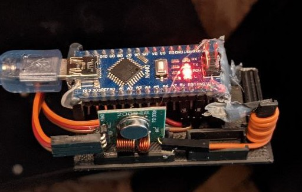
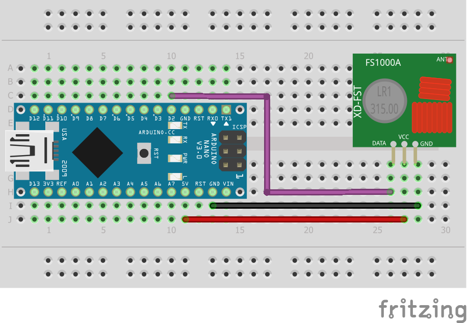

# serial_rf_transmitter
Simple script to enable RFsend commands over usb serial. The commands are expected to be sent in HEX format (0x0...) and the only length stablished is 24bit.

## 3D Case/Stand
I repuposed [this](https://www.thingiverse.com/thing:3742725) case from *thingiverse* to accomodate the RF transmitter and the Arduino Nano with a little bit of hot glue.



## Connection

Here is my setup as an example:



## Usage

On HomeAssitant you need the system to open the serial connection for you. To do so we will be adding a sensor over serial (although we don't need to read anything from it):

``` yaml
sensor:
  - platform: serial
    # See the port on the supervisor...
    serial_port: /dev/serial/by-id/usb-1a86_USB2.0-Serial-if00-port0 
    baudrate: 9600
```

Then we can execute `echo` commands over that device:

``` yaml
switch:
  - platform: command_line
    switches:
      nano_pasillo:
        command_on: "echo 0x14455 >  /dev/serial/by-id/usb-1a86_USB2.0-Serial-if00-port0"
        command_off: "echo 0x14454 >  /dev/serial/by-id/usb-1a86_USB2.0-Serial-if00-port0"
```